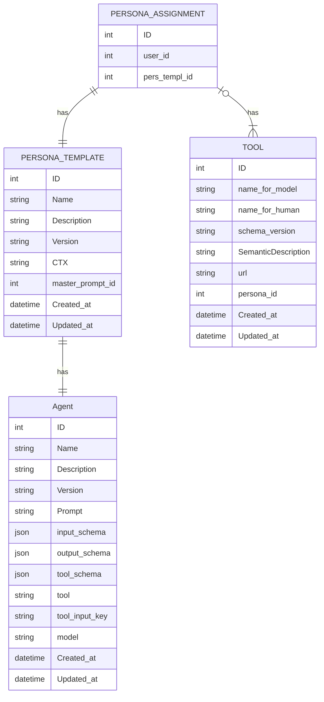
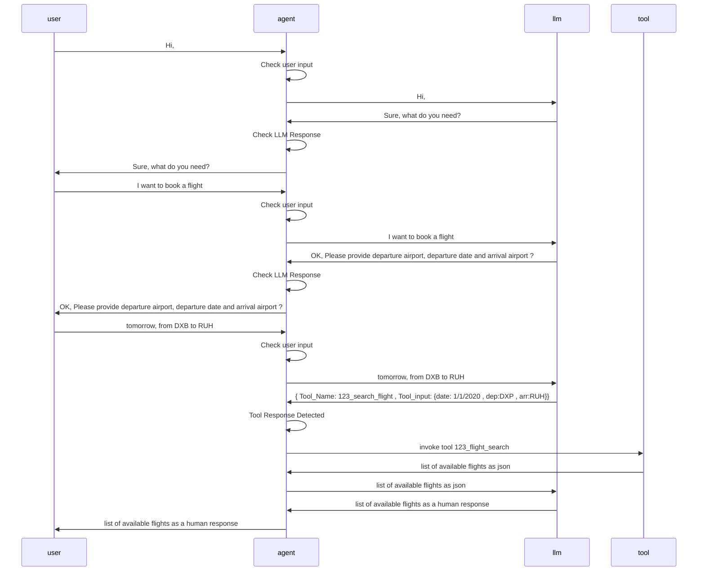

# Introduction

This component is an AI bot that uses **LLM** **L**arge **L**anguage **M**odels
(such as OpenAI) to drive chatbot conversations between businesses and their
customers with minimal onboarding effort with the ability to interact with the
external world using tools.

This sample project tested and developed using Deno Typescript runtime
https://deno.com/ as a show case for the idea

## Features

- The bot can understand natural language input from customers and generate
  relevant and engaging responses.
- The bot can use tools only by their semantic description, for example “Use
  this tool when you want to book a flight ,This tool expecting departure date,
  departure airport and destination airport as input” .
- Bot will utilize the outstanding reasoning abilities for LLMs to collect data
  and decide at runtime which tool it should be used.
- Bot call these tools from code that generated before with some helper
  utilities during the onboarding process.
- The bot can adapt to different domains and scenarios by
  - Select the base “Agent ⇒ Master Prompt”
  - given a proper context at the build time

## Repository

[https://github.com/cequens-shabana](https://github.com/cequens-shabana)

## Components

### 1. Agent:

This is the key component in the solution , it consists of

master_prompt_template ,LLM model , supported LLM response schema , LLM tools
invokation schema , and LLM tool invokation key

### 2. Persona:

This is what gives an agent the required personality per each use case.

### 3. Tools:

A set of tool that enable to LLM to interact with the external world .

## Component Diagram



## Solution Key Concepts

The main idea behind this solution is to build a powerful prompt that can guide
the language model to generate the desired output for the chatbot. The prompt
consists of three parts:

1. The main prompt template :

   This is the one who contain the reasoning logic and the place holders for the
   Context and Tools

2. The context : This is what personalize the prompt for a specific customer use
   case i.e. customer name and domain , for example act as a professional flight
   call center agent for FlyX company
3. Tools : This is a list of available tools for this customer , it suppose to
   have a name and some description for the tool usage and its pre-requests , So
   the header of this can be Tool_Name | Tool_Description | Tool_PreRequests or
   at least Tool_Name | Tool_Description While the tool description suppose to
   include the required pre-requests before use this tool

The _Tool Name_ Field suppose to be built at the onboarding time , and suppose
to include somehow a reference for its customer for example
${PERSONA_ASSIGNMENT}_ToolName 1234_flight_booking_api At the runtime when the
agent runner find the LLM call referring to a tool ( By validating it against
agent tool_schema ) it will search at the datastore for the required code_string
and based on the agent tool_input_key

4. Tool onboarding At this stage we suppose at the onboarding UI we will have
   some workflow that ends up generated some code like below

```tsx
function f() {
  console.log("hi this is a tool ");
  return "not flights avaialble";
}

// The value that will be store at the datastore
const value = f.toString();
```

e. Tool invokation

```tsx
// After retrieving the code value from datastore we can invoke it as below

const dynamicFunction = eval(`(${sayHello2})`);
const input_key = agent.tool_input_key;
const response_from_llm = callLLM(query);
dynamicFunction(response_from_llm[input_key]);
```

## Sequens Diagram


