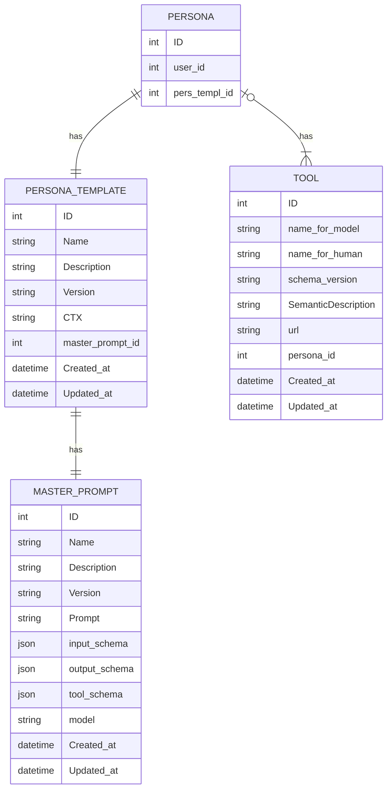

```mermaid
erDiagram
    PERSONA ||--|| PERSONA_TEMPLATE : has
    PERSONA_TEMPLATE ||--|| MASTER_PROMPT : has
    PERSONA |o--|{ TOOL : has
    MASTER_PROMPT {
        int ID
        string Name
        string Description
        string Version
        string Prompt
        json input_schema
        json output_schema
        json tool_schema
        string model
        datetime Created_at
        datetime Updated_at
    }
    PERSONA_TEMPLATE {
        int ID
        string Name
        string Description
        string Version
        string CTX
        int master_prompt_id
        datetime Created_at
        datetime Updated_at
    }
    PERSONA {
        int ID
        int user_id
        int pers_templ_id
    }
    TOOL {
        int ID
        string name_for_model
        string name_for_human
        string schema_version
        string SemanticDescription
        string url 
        int persona_id 
        datetime Created_at 
        datetime Updated_at 
    }
```