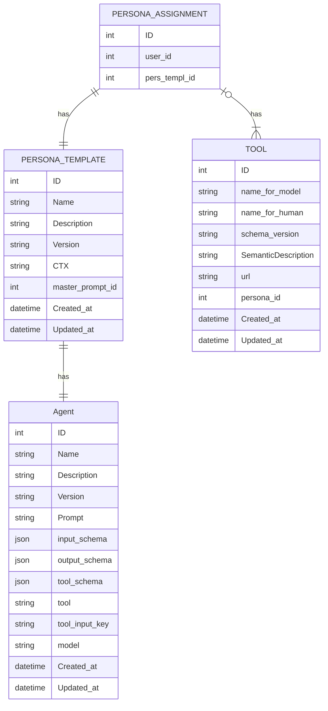
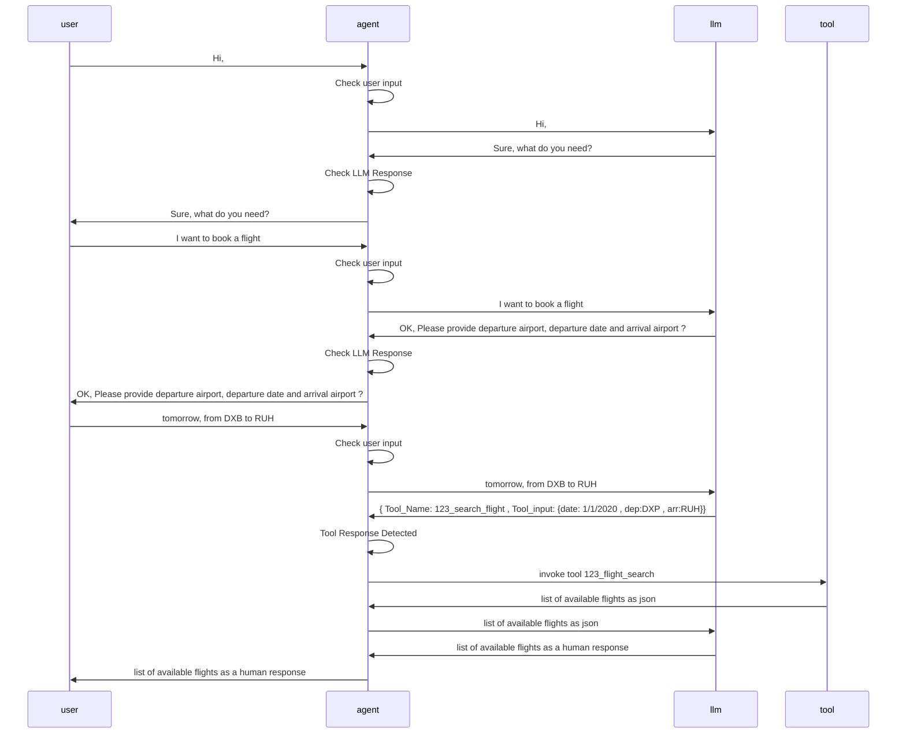

```mermaid
erDiagram
    PERSONA_ASSIGNMENT ||--|| PERSONA_TEMPLATE : has
    PERSONA_TEMPLATE ||--|| Agent : has
    PERSONA_ASSIGNMENT |o--|{ TOOL : has
    Agent {
        int ID
        string Name
        string Description
        string Version
        string Prompt
        json input_schema
        json output_schema
        json tool_schema
        string tool
        string tool_input_key
        string model
        datetime Created_at
        datetime Updated_at
    }
    PERSONA_TEMPLATE {
        int ID
        string Name
        string Description
        string Version
        string CTX
        int master_prompt_id
        datetime Created_at
        datetime Updated_at
    }
    PERSONA_ASSIGNMENT {
        int ID
        int user_id
        int pers_templ_id
    }
    TOOL {
        int ID
        string name_for_model
        string name_for_human
        string schema_version
        string SemanticDescription
        string url 
        int persona_id 
        datetime Created_at 
        datetime Updated_at 
    }
```

```mermaid
sequenceDiagram
    participant user
    participant agent
    participant llm
    participant tool
    user->>agent: Hi, 
    agent->>agent: Check user input
    agent->>llm: Hi, 
    llm->>agent: Sure, what do you need?
    agent->>agent: Check LLM Response 
    agent->>user:Sure, what do you need?
    user->>agent: I want to book a flight
    agent->>agent: Check user input
    agent->>llm: I want to book a flight
    llm->>agent: OK, Please provide departure airport, departure date and arrival airport ?
    agent->>agent: Check LLM Response 
    agent->>user: OK, Please provide departure airport, departure date and arrival airport ?
    user->>agent: tomorrow, from DXB to RUH
    agent->>agent: Check user input
    agent->>llm: tomorrow, from DXB to RUH
    llm->>agent: { Tool_Name: 123_search_flight , Tool_input: {date: 1/1/2020 , dep:DXP , arr:RUH}}
    agent->>agent: Tool Response Detected 
    agent->>tool: invoke tool 123_flight_search
    tool->>agent: list of available flights as json
    agent->>llm: list of available flights as json
    llm->>agent: list of available flights as a human response 
    agent->>user:list of available flights as a human response 
```